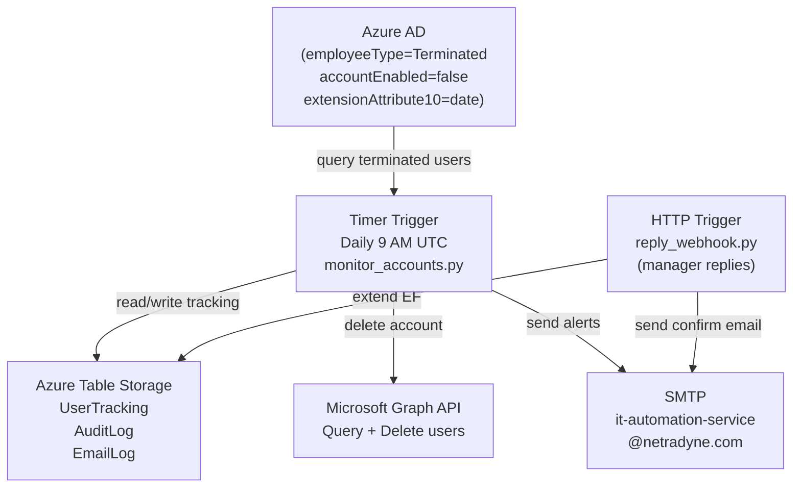
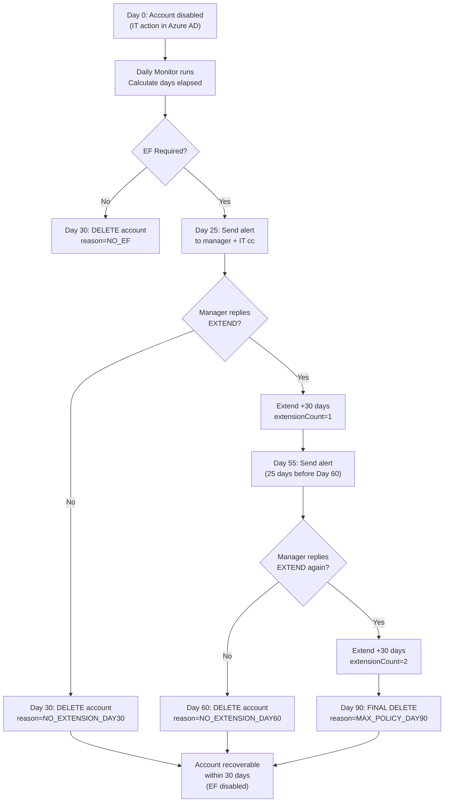

# Email Forwarding & Account Deletion Automation - Build Plan

## Review Summary

The existing design documents in [DEVELOPER_BUILD_GUIDE.md](DEVELOPER_BUILD_GUIDE.md) and [UPDATED_WORKFLOW_WITH_DELETION.md](UPDATED_WORKFLOW_WITH_DELETION.md) are sound. The core logic, email templates, Graph API calls, and workflow are all defined. What needs to be built is the actual runnable code.

## Table Storage vs SQL - Feasibility Decision

**Azure Table Storage is fully sufficient** for this project. Here is why:

- The only queries needed are:
  - Lookup a user by `userId` (direct RowKey lookup - O(1))
  - Scan all active/monitored users daily (small dataset, full table scan is fine)
  - Append audit log entries (insert only)
- No JOINs, no aggregations, no complex filters are needed
- Expected volume: hundreds of records at most (not thousands)
- **Cost: ~$1/month vs $15/month for SQL S0 - saves $168/year**

**Table Storage Schema (replacing SQL):**

- `UserTracking` table - PartitionKey=`"EF"`, RowKey=`userId`
  - Properties: `userEmail`, `displayName`, `managerEmail`, `offboardDate`, `efRequired`, `statusCode`, `extensionCount`, `deleteDate`, `deletedDate`, `lastAlertDate`
- `AuditLog` table - PartitionKey=`userId`, RowKey=`"{timestamp}_{action}"`
  - Properties: `action`, `details`
- `EmailLog` table - PartitionKey=`userId`, RowKey=`"{timestamp}_{emailType}"`
  - Properties: `recipientEmail`, `subject`, `status`, `errorMessage`

## Architecture



## Workflow Logic



## Project File Structure

All files will be created fresh under the existing `Email-forwarding/` workspace folder:

```
Email-forwarding/
src/
  function_app.py        # Azure Functions v2 app - registers all triggers
  monitor_accounts.py    # Timer trigger: daily monitoring + deletion logic
  reply_webhook.py       # HTTP trigger: processes manager "EXTEND" replies
  email_sender.py        # SMTP utility using it-automation-service@netradyne.com
  table_store.py         # Azure Table Storage CRUD (replaces SQL)
  graph_api.py           # Microsoft Graph API: query + delete AD users
requirements.txt         # azure-functions, azure-data-tables, azure-identity, msgraph-sdk
host.json                # Functions host config
local.settings.json.example  # Environment variable template (not committed)
```

## Key Implementation Details

### `table_store.py` - Table Storage replaces SQL
Uses `azure-data-tables` SDK. Key operations:
- `upsert_user(entity)` - create or update UserTracking record
- `get_user(user_id)` - direct RowKey lookup
- `list_active_users()` - scan all users where statusCode != DELETED
- `append_audit(user_id, action, details)` - insert into AuditLog

### `monitor_accounts.py` - Core Logic
Timer trigger `0 0 9 * * *` (9 AM UTC daily). For each terminated+disabled user:
- Parse `extensionAttribute10` as offboard date
- Detect EF requirement by checking Exchange mail forwarding rules via Graph API
- Apply decision logic based on `days_elapsed` and `extensionCount`
- Call `delete_account()` or `send_alert_email()` as needed

### `reply_webhook.py` - Extension Processing
HTTP POST endpoint. Receives email reply webhook payload (e.g., from Exchange transport rule or Power Automate forwarding replies to it). Validates sender is the manager on record, checks for "EXTEND" keyword, increments `extensionCount`, recalculates `deleteDate`.

### `graph_api.py` - Azure AD Operations
Two calls needed:
- `GET /users?$filter=employeeType eq 'Terminated' and accountEnabled eq false&$select=id,mail,displayName,extensionAttributes,manager`
- `DELETE /users/{id}` - hard delete (goes to 30-day recycle bin in Entra natively)

**Important**: Azure AD's own recycle bin (30-day soft delete) already provides the account recovery capability — no extra recovery code needed.

### `email_sender.py` - SMTP via Exchange
Connects to `smtp.office365.com:587` with STARTTLS. Uses `it-automation-service@netradyne.com` credentials stored in Azure Key Vault (accessed via Managed Identity). Sends 4 email types: `ALERT`, `EXTENSION_CONFIRM`, `DELETION_NOTICE`, `FINAL_DELETION_NOTICE`.

## Cost Breakdown

- Azure Functions (Consumption): $0-2/month
- Azure Table Storage: ~$1/month
- Storage Account (code hosting): $1/month
- SMTP via Exchange: $0
- Managed Identity: $0
- **Total: ~$3-4/month** (vs $17/month with SQL, vs $46+ with Logic Apps)

## Azure Permissions Required

Managed Identity on the Function App needs:
- `Directory.Read.All` - read terminated users
- `User.ReadWrite.All` - delete accounts
- `Mail.ReadWrite` or `MailboxSettings.Read` - check forwarding rules
- Storage Account: `Storage Table Data Contributor` role

## Build Phases

**Phase 1 - Infrastructure (2-3 hours)**
- Resource Group, Storage Account, Function App (Consumption, Python 3.11)
- Enable System-assigned Managed Identity on Function App
- Assign Graph API permissions to Managed Identity via Azure AD app roles
- Configure Key Vault for SMTP password + connection strings

**Phase 2 - Table Storage Layer (1-2 hours)**
- Create 3 tables: `UserTracking`, `AuditLog`, `EmailLog`
- Write and test `table_store.py`

**Phase 3 - Core Functions (8-12 hours)**
- `graph_api.py` - query + delete users
- `email_sender.py` - SMTP sending
- `monitor_accounts.py` - full decision logic
- `function_app.py` - wire up timer trigger

**Phase 4 - Reply Webhook (3-5 hours)**
- `reply_webhook.py` - HTTP trigger
- Set up email forwarding of replies to this endpoint (Exchange transport rule or Power Automate)

**Phase 5 - Test + Deploy (5-8 hours)**
- Local testing with `func start` and test data
- UAT with 5-10 real terminated accounts (non-destructive first)
- Deploy to production Function App
- Monitor for 7 days

## Environment Variables (local.settings.json.example)
```json
{
  "AZURE_TENANT_ID": "",
  "STORAGE_ACCOUNT_NAME": "",
  "SMTP_SERVER": "smtp.office365.com",
  "SMTP_PORT": "587",
  "SENDER_EMAIL": "it-automation-service@netradyne.com",
  "SENDER_PASSWORD": "",
  "IT_EMAIL": "it-operations@netradyne.com",
  "RECOVERY_GRACE_DAYS": "30"
}
```
