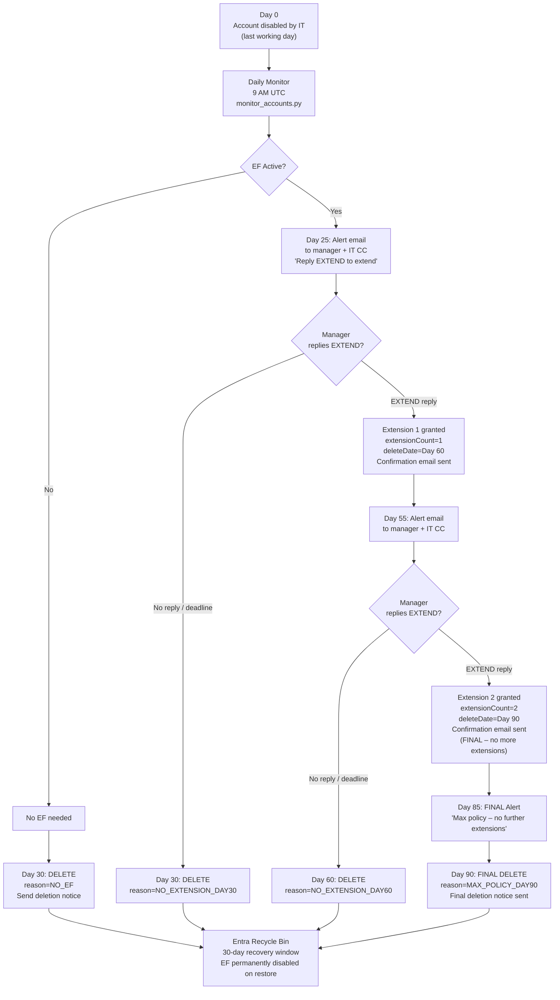

# Workflow A – Fully Automated Email-Reply Extension

## Overview

The manager receives an alert email on Day 25 (and Day 55 / Day 85 for
subsequent periods).  To grant an extension, the manager simply **replies to
that email** with the word "EXTEND".  The system processes the reply
automatically — no tickets, no IT involvement, no manual attribute edits.

---

## Step-by-step flow

```
Day 0   Account disabled by IT (last working day)
          │
          ▼
          Daily monitor runs at 9 AM UTC
          Reads Azure AD for terminated+disabled users
          Detects whether Email Forwarding is active
          │
          ├── EF NOT active ──────────────────────────────────────────────────────┐
          │                                                                       │
          │   Day 30: auto-delete account                                         │
          │   Send deletion notice → manager + IT CC                             │
          │                                                                       │
          └── EF ACTIVE ──────────────────────────────────────────────────────────┤
                                                                                  │
              Day 25: alert email → manager (IT CC)                               │
              Subject: "Email Forwarding expires in 5 days – Action Required"     │
              Body: "Reply EXTEND to add 30 more days"                            │
                │                                                                  │
                ├── Manager does NOT reply ────────────────────────────────────────┤
                │   Day 30: auto-delete + deletion notice                          │
                │                                                                  │
                └── Manager replies "EXTEND" ──────────────────────────────────────┤
                    Power Automate receives reply                                  │
                    POSTs to Azure Function webhook                                │
                    System validates sender = registered manager                  │
                    extensionCount incremented (0 → 1)                            │
                    deleteDate pushed to Day 60                                   │
                    Confirmation email sent to manager                            │
                        │                                                          │
                        ├── Day 55: Second alert (same process) ─────────────────┤
                        │   Manager can extend to Day 90                          │
                        │   or account deleted on Day 60                          │
                        │                                                          │
                        └── Day 85: Final alert (FINAL NOTICE banner)             │
                            No further extensions possible                        │
                            Day 90: final deletion                                │
                            Deletion notice + recovery instructions               │
                                                                                  │
          All deletions → Entra recycle bin (30-day recovery window) ◄────────────┘
```

---

## Full Mermaid diagram



---

## Key technical actors

| Component | Role |
|-----------|------|
| **Azure AD** | Source of truth for terminated+disabled users and offboard date |
| **monitor_accounts.py** | Timer function – daily decision engine |
| **reply_webhook.py** | HTTP function – processes manager replies |
| **Power Automate** | Routes manager email replies to the webhook |
| **Azure Table Storage** | Tracks state per user (status, extension count, dates) |
| **Azure Key Vault** | Stores SMTP password securely |
| **Microsoft Graph API** | Checks EF status, deletes accounts |

---

## Policy summary

| Scenario | Outcome |
|----------|---------|
| No EF active | Auto-delete Day 30 |
| EF active, no extension | Auto-delete Day 30 |
| 1 extension granted | Auto-delete Day 60 if no second extension |
| 2 extensions granted | Auto-delete Day 90 (hard cap) |
| Any deletion | Recoverable within 30 days via Entra recycle bin (EF disabled on restore) |

Maximum forwarding period: **90 days from offboarding date** (hard policy cap).

---

## What IT does in this workflow

| Task | IT involvement |
|------|----------------|
| Offboard the user (disable account, set EF if requested) | **Manual – IT action on Day 0** |
| Monitor forwarding expiry | **Automated – zero IT effort** |
| Send alerts | **Automated** |
| Process extension requests | **Automated** |
| Delete accounts on schedule | **Automated** |
| Account recovery (if needed) | **Manual – IT action on request** |

IT's daily workload for ongoing EF management: **zero**.
