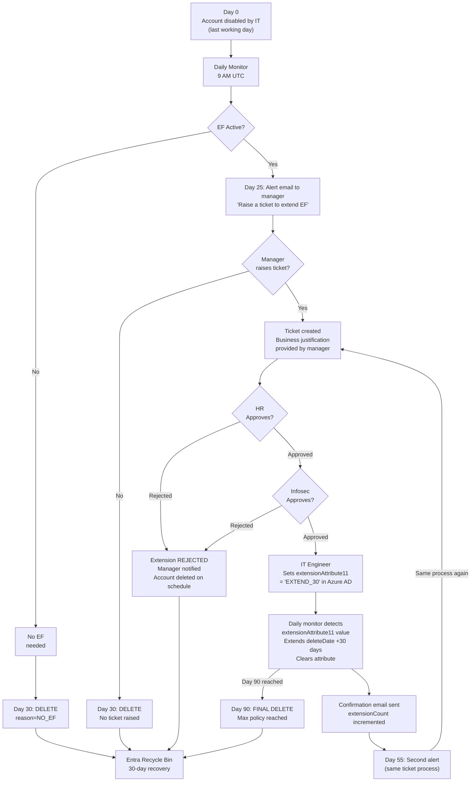

# Workflow B – Ticket + HR/Infosec Approval with Manual Attribute Update

## Overview

The manager receives an alert email on Day 25 / Day 55.  To request an
extension they must **raise a ticket** (e.g., in ServiceNow / Jira Service
Management) with a business justification, wait for **HR and Infosec
approval**, and then an **IT Engineer manually sets an Azure AD attribute**
on the user.  The daily script reads that attribute and either extends or
deletes the account accordingly.

---

## Step-by-step flow

```
Day 0   Account disabled by IT (last working day)
          │
          ▼
          Daily monitor runs at 9 AM UTC
          │
          ├── EF NOT active → Day 30: auto-delete (same as Workflow A)
          │
          └── EF ACTIVE
                │
                Day 25: alert email → manager (IT CC)
                "Raise a ticket to request extension. Provide business justification."
                │
                ├── Manager does NOT raise a ticket ──────────────────────────────┐
                │   Day 30: auto-delete + deletion notice                         │
                │                                                                 │
                └── Manager raises ticket ─────────────────────────────────────── │
                    [ServiceDesk / Jira ticket created]                            │
                    Ticket includes: user, justification, duration requested       │
                          │                                                        │
                          ├── HR reviews ticket ──────────────────────────────────│
                          │   Approves or rejects                                 │
                          │                                                        │
                          ├── Infosec reviews ticket ─────────────────────────────│
                          │   Approves or rejects (security/data risk check)      │
                          │                                                        │
                          └── Both approved ──────────────────────────────────────│
                              IT Engineer opens Azure AD                          │
                              Manually sets extensionAttribute11 = "EXTEND_30"    │
                              (or a specific new expiry date)                     │
                                    │                                             │
                                    Daily monitor detects attribute value         │
                                    Extends deleteDate by 30 days                 │
                                    Clears attribute after processing             │
                                    Confirmation logged in audit trail            │
                                          │                                       │
                                          (repeat for second extension)           │
                                          │                                       │
                                    Day 90: Final deletion (hard cap)  ◄──────────┘
```

---

## Full Mermaid diagram



---

## What the attribute-based extension looks like in code

If this workflow is chosen, the daily monitor script would need an additional
check before applying the deletion logic:

```python
# Pseudocode for Workflow B attribute check
EXTENSION_ATTR = "extensionAttribute11"   # new dedicated attribute

def check_extension_attribute(user: dict) -> bool:
    """Return True if IT has set the extension approval attribute."""
    attrs = user.get("onPremisesExtensionAttributes") or {}
    value = attrs.get(EXTENSION_ATTR, "").strip().upper()
    return value in ("EXTEND_30", "APPROVED", "YES")

def clear_extension_attribute(user_id: str):
    """Clear the attribute after processing so it does not re-trigger."""
    graph_api.patch_user(user_id, {
        "onPremisesExtensionAttributes": {EXTENSION_ATTR: None}
    })
```

**Important constraint**: If users are synced from on-premises Active Directory,
IT cannot set `onPremisesExtensionAttributes` directly in Azure AD — they must
update the attribute in the on-prem AD and wait for the next Azure AD Connect
sync cycle (typically 30 minutes).  This adds latency.

---

## Approval SLA assumption

For this workflow to function reliably, the organisation needs:

- HR response SLA: **≤ 2 business days**
- Infosec response SLA: **≤ 2 business days**
- IT Engineer attribute update: **same day as approval**

Without enforced SLAs, an extension request raised on Day 25 may not be
processed before the Day 30 deletion deadline.

---

## What IT does in this workflow

| Task | IT involvement |
|------|----------------|
| Offboard the user (disable account, set EF if requested) | **Manual – Day 0** |
| Monitor forwarding expiry | **Automated** |
| Send alerts | **Automated** |
| Process extension tickets | **Manual – IT reviews ticket** |
| Set Azure AD attribute on approval | **Manual – per extension request** |
| Delete accounts on schedule | **Automated** (after attribute check) |
| Account recovery | **Manual – on request** |

IT's ongoing workload: **manual intervention required per extension request**.
